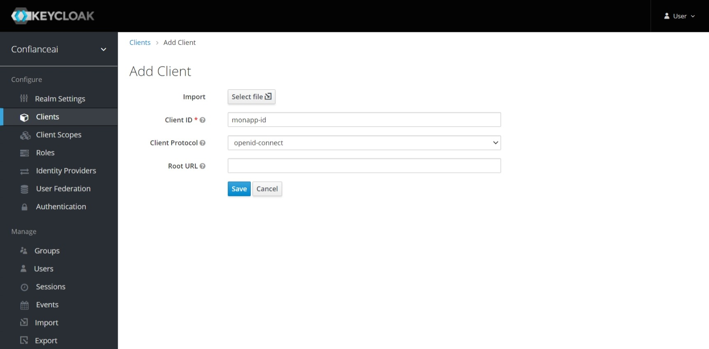
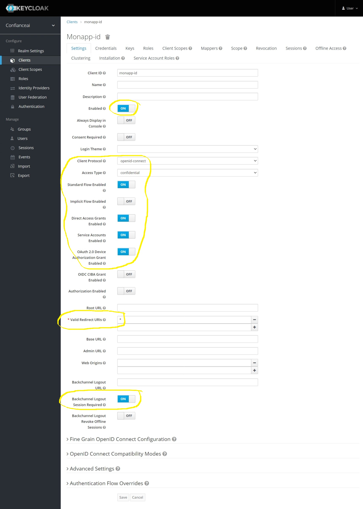
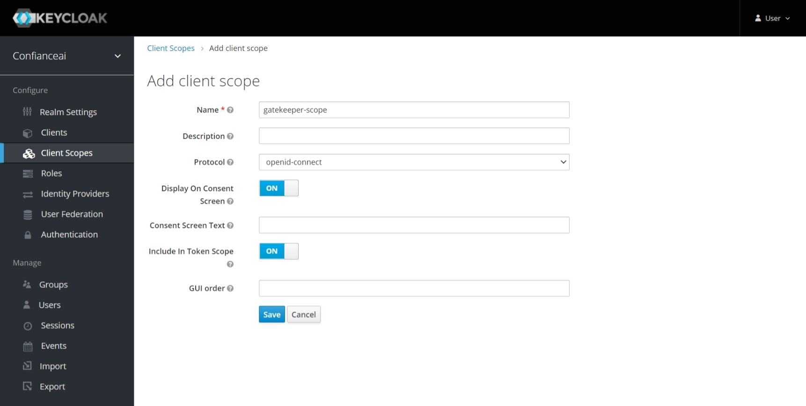
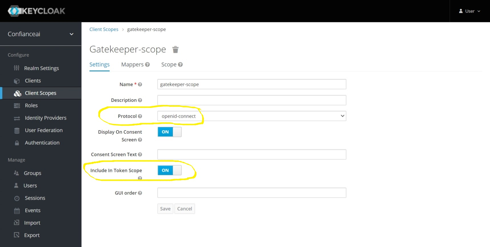
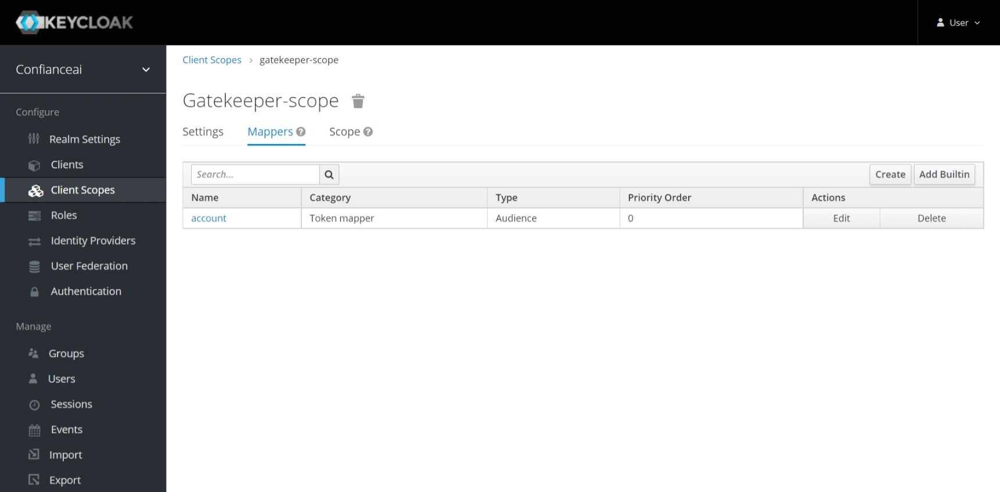
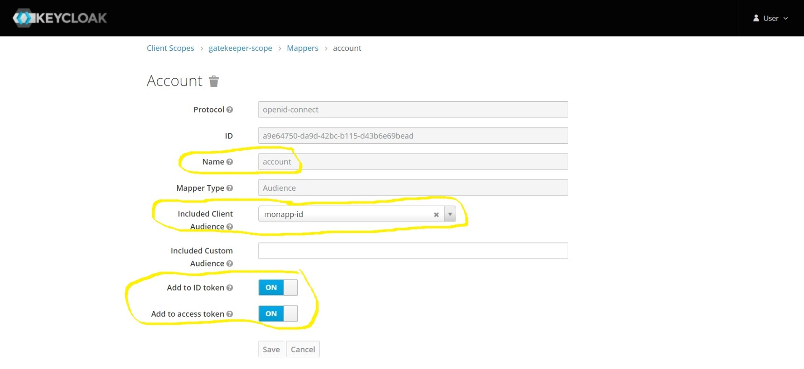
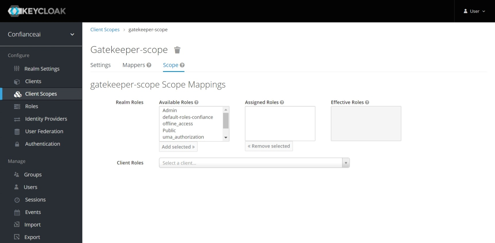
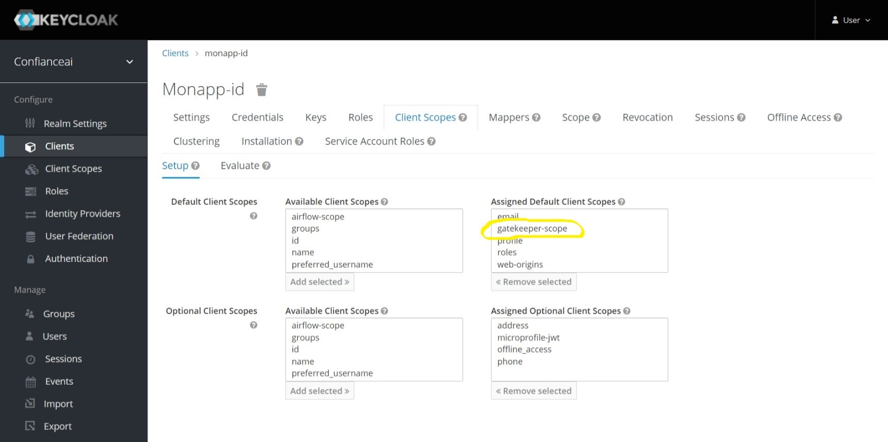
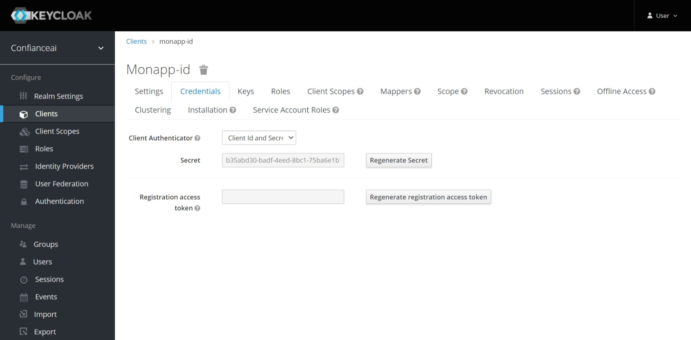

# Configuration de keycloak pour l'instégration de l'application

Afin d'ajouter la fonctionnalité de l'authentification sur une application qui en ait dépouvu, nous utilisons un proxy d'authentification à partir de projet [gogatekeeper](https://github.com/gogatekeeper/gatekeeper).

## Création d'un contexte d'application

Sur l'UI de keycloak, en tant qu'administrateur, il faut créer un ___client___ dans le menu ___Clients___ en spécifiant le ___Client ID___ qui sera utilisé par (gatekeeper_deployment.yaml)[templates/gatekeeper_deployment.yaml]

Définiser tous les paramètres mis en surbrillances dans l'images ci-dessous :

Il faut maintenant définir un scope pour le client. Pour cela, aller dans le menu ___Client Scopes___ et clicker sur ___Create___. Mettre son nom ici ___gatekeeper_scope___

Assurer vous que __Protocol___ et ___Include In Token Scope___ sont à la bonne valeur

Dans le ___Mappers___ crée un nouvelle entré de valeur ___account___ en appyant sur le bouton ___Create___  et selectionner le bon type dans ___Mapper Type___ à ___Audience___

Assurer vous que les paramètres ___Add to ID token___ et ___Add to access token___ sont bien à ___On___

Rien à mettre dans le scope.

Après avoir créer le ___client_scopes___, il faut l'ajouter à l'application. Pour cela, il faut aller dans la configuration de l'application, dans le menu ___Client Scopes___, et y ajouter le ___Assigned Dafaut Client Scopes___ le ___client_scopes___ qui vient dêtre créé. Ici ___gatekeeper-scope___.

Les crédentials sont récupérables sur l'onglet ___Credentials___ qui seront utilisés pour la configuration des values.yml du fichier Helm.

## Fabrication du helm de l'application

Afin de packager une application sous Helm, il faut une image docker et le client helm installé sur son PC.
Faire un ___helm create monapp___

Poser les fichiers suivants dans le le répertoire créé ___monapp/templates/___
- gatekeeper_deployment.yaml
- gatekeeper_ingress.yaml
- gatekeeper_service.yaml

Ajouter à la fin de du fichier ___values.yaml___ de votrer application le script suivant :

Il est ___important___ que l'ingress de l'application à protéger soit à la value ___false___, il ne faut pas de l'application soit exposé en direct sinon ce sera contre productif.

~~~yaml
# ========================== gatekeeper begin =================================
gatekeeper:
  image:
    repository: quay.io/gogatekeeper/gatekeeper
    pullPolicy: IfNotPresent
    # Overrides the image tag whose default is the chart appVersion.
    tag: "1.3.5"

  imagePullSecrets: []
  nameOverride: ""
  fullnameOverride: ""

  keycloak:
    # Url d'accès à keycloak : https://<fqdn de keycloak>/auth/realms/<nom du realm>
    keycloak_url: https://keycloak.confiance.irtsysx.fr/auth/realms/confianceai
    # Nom du "Client Id", voir https://git.irt-systemx.fr/mickael.patron1/monapp/-/blob/master/keycloak_configuration.md
    client-id: monapp-id
    # Valeur du password, voir les crédentials dans https://git.irt-systemx.fr/mickael.patron1/monapp/-/blob/master/keycloak_configuration.md
    client-secret: b35abd30-badf-4eed-8bc1-75ba6e1b768f
    # Les mots de passe du l'application pour la communication avec keycloak. Y mettre une valeur random.
    # exemple : tr -dc A-Za-z0-9 </dev/urandom | head -c 40 ; echo ''
    encryption-key: 45afw8I8CzEAalQjGiRBB2CuQvvuJwTp

  serviceAccount:
    # Specifies whether a service account should be created
    create: true
    # Annotations to add to the service account
    annotations: {}
    # The name of the service account to use.
    # If not set and create is true, a name is generated using the fullname template
    name: ""

  podAnnotations: {}

  podSecurityContext: {}
    # fsGroup: 2000

  securityContext: {}
    # capabilities:
    #   drop:
    #   - ALL
    # readOnlyRootFilesystem: true
    # runAsNonRoot: true
    # runAsUser: 1000

  service:
    type: ClusterIP
    port: 8080

  ingress:
    enabled: true
    className: ""
    annotations:
      kubernetes.io/ingress.class: traefik
      traefik.ingress.kubernetes.io/redirect-entry-point: https
    hosts:
      - host: monapp.confiance.irtsysx.fr
        paths:
          - path: /
            pathType: ImplementationSpecific
    tls: []
    #  - secretName: chart-example-tls
    #    hosts:
    #      - chart-example.local

  resources:
    # We usually recommend not to specify default resources and to leave this as a conscious
    # choice for the user. This also increases chances charts run on environments with little
    # resources, such as Minikube. If you do want to specify resources, uncomment the following
    # lines, adjust them as necessary, and remove the curly braces after 'resources:'.
    limits:
      cpu: 100m
      memory: 128Mi
    requests:
      cpu: 100m
      memory: 128Mi
# ========================== gatekeeper end ===================================
~~~

## En cas d'erreur 404

[Voir si la gestion de l'audience est opérationnel.](https://stackoverflow.com/questions/53550321/keycloak-gatekeeper-aud-claim-and-client-id-do-not-match)
